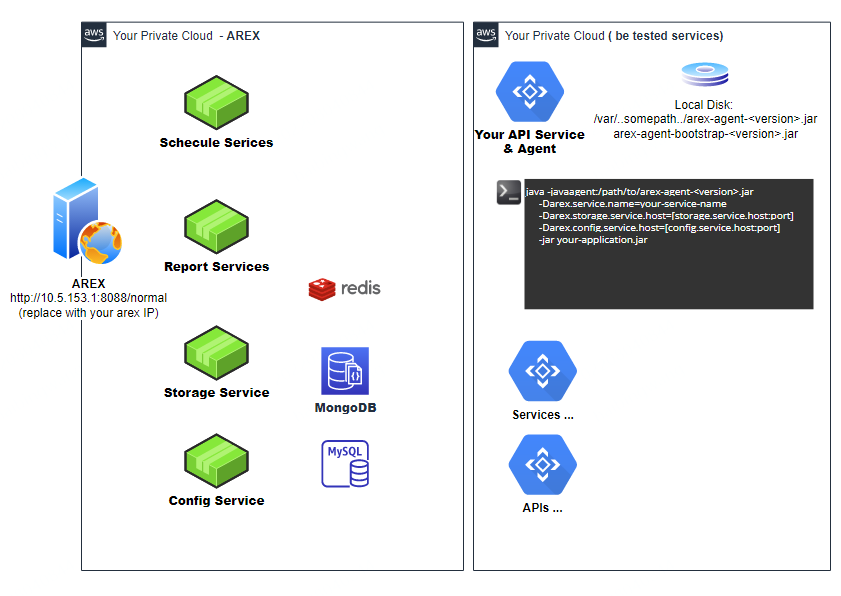

## AREX组成
  
### 组成概要

  
#### 数据存储
* Redis, Storage存储服务在回放过程中缓存数据使用
* MongoDB, 存储服务存储录制数据和回放结果
* MySQL, 存储管理类数据

### AREX模块

#### AREX前端 [AREX](https://github.com/arextest/arex)
AREX前端是AREX工具的前端操作界面
* 常规测试, 类Postman的测试,用例设置,执行,结果ASSERT等
* 比对测试, 对不同的接口发送同一个请求,并比对返回结果存在的差异, 支持非MOCK的测试,也支持AREX真实数据MOCK的测试
* 回放测试, 用真实的生产数据进行比对测试   
  
  
#### 配置服务 [配置服务(Configuration Service)](https://github.com/arextest/arex-config)
##### Agent录制配置
* Agent录制的配置,包括录制的时间段,时间范围,频率等  

* Agent录制的告警配置

##### AREX回放配置
目前包括AREX回放用例的时间范围(days)  
一天内的CASE,则设置 1 days

##### 比对差异配置
* 比较差异的排除节点 (不进行比对)
* 比较差异的包含节点 (必须进行比对)
* Array类型的节点排序方法 (涉及到比对的一对一关系)
* Reference节点配置 (复杂报文中如何设计到节点间的引用,可以配置Reference关联比对)

#### 调度服务[Schedule Service](https://github.com/arextest/arex-replay-schedule)  
调度服务负责向被测试服务发送用例回放请求,并在服务响应后触发结果比对及依赖比对
* 服务调度
* 比对SDK的比对执行

#### 存储服务[Storage Service](https://github.com/arextest/arex-storage)
* 存储服务负责接收Agent捕获的请求,应答,依赖的真实数据的存储, 
* 提供在回放期间,按照Agent要求返回已存储的数据

#### 报告分析服务 [Report Service](https://github.com/arextest/arex-report)
报告分析服务,负责在执行回放测试时,测试结果的收集和问题展示

