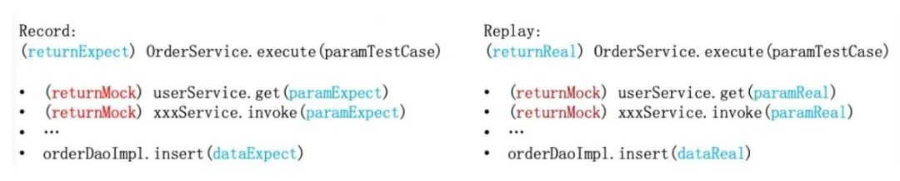
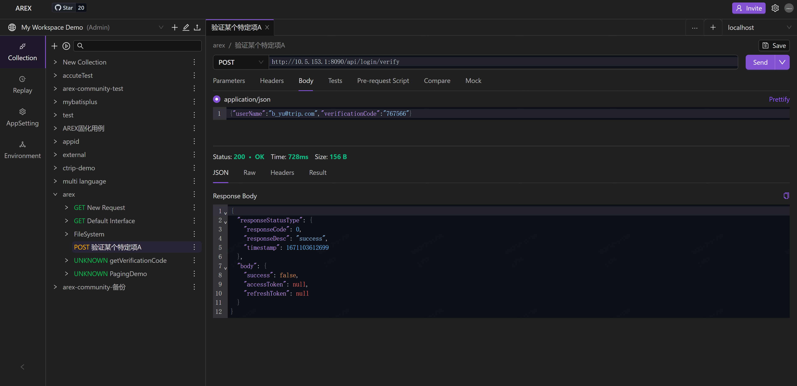

## AREX介绍

### 背景
对于一个初上线的简单服务，只需通过常规的自动化测试加上人工即可解决，但我们线上核心的业务系统往往比较复杂，通常也会频繁的需求迭代，如何保证被修改后的系统原有业务的正确性就比较重要。常规的自动化测试需要投入大量的人力资源，准备测试数据、脚本等，并且覆盖率通常也不高，难以满足要求。  
为了保证一个线上系统的稳定性，开发和测试人员都面临不少的挑战：  
* 开发完成后难以快速本地验证，发现初步的问题，容易陷入提测->发现 bug->fix->提测的循环
* 准备测试数据、自动化脚本编写和维护需要大量的人力成本，而且难以保证覆盖率
* 写服务难于验证，而且测试会产生脏数据，例如我们的核心交易系统，可能会往数据库、消息队列、Redis 等写入数据，这部分数据往往比较难以验证，测试产生的数据也难于清理
* 线上问题难以本地复现，排查困难
### 什么是AREX
AREX 通过复制线上真实流量到测试环境进行自动化回归测试，解决回归测试的难题。  
AREX 采用 java 的 instrument 实现了无代码侵入的数据采集和自动化 Mock，智能的 Mock 机制使测试运行代码集中在待测应用，不会产生真正的外部交互（DB 的写入、其它服务的调用），也完美支持了写接口的测试（如核心交易系统、库存系统等）。  
AREX支持的API测试包括  
* 常规测试, 类Postman的测试,用例设置,执行,结果ASSERT等
* 比对测试, 对不同的接口发送同一个请求,并比对返回结果存在的差异, 支持非MOCK的测试,也支持AREX真实数据MOCK的测试
* 回放测试, 用真实的生产数据进行比对测试

#### 原理示例   
我们假定生产环境应用会正常的响应用户的请求，通过 aop 的方式将请求入参及返回结果以及执行过程中的一些快照数据例如访问数据库的入参和返回结果、访问远程服务器的入参及结果保存下来。然后将快照数据发送给测试机器（代码发生变化的机器）完成一次回放过程。通过将落库数据、调用后台请求的数据以及返回结果和线上真实请求发生时的数据进行对比，发现其中的差异，从而识别被测试系统的问题。  


* xxxTestCase: 采集下来的数据在回放时做为测试 CASE
* xxxMock：在回放时会使用采集的数据进行 Mock，代替真正的数据访问
* xxxExpect 和 xxxReal：在测试结束后会验证对应的数据，发现代码中潜藏的隐患


#### 技术原理  
在 JDK1.5 中，Java 引入了 java.lang.Instrument 包，该包提供了一些工具帮助开发人员在 Java 程序运行时，动态修改系统中的 Class，以此实现对原类的功能增强。现在有很多工具都是基于此技术实现的，例如阿里开源的 arthas、监控工具 SkyWalking 等， AREX 的数据采集和自动 Mock 也是基于此技术实现。

### 平台优势

#### 低成本  
无代码侵入，基本无接入成本  
无需编写测试用例，海量的线上请求也能保证高覆盖率  
插桩代码足够简单，性能损耗低  

#### 多样性支持  
支持写验证，支持数据库、消息队列、Redis 数据的验证，甚至支持验证运行时的内存数据，并且测试时不会产生脏数据。

#### 测试用例运行稳定  
支持各种主流技术框架的自动数据采集和 Mock，参见：arex_java ,并且支持了本地时间、缓存，在回放时精准还原生产执行时的数据环境。

#### 快速线上问题复现  
支持一键本地调试，可以快速本地调试线上问题

#### 安全稳定  
代码隔离，也实现了健康管理，在系统繁忙时会智能降低或关闭数据采集频率

#### 良好的功能测试支持  
支持测试脚本，也可对采集的数据进行简单的编辑实现固定测试观点的测试，避免大量的测试数据准备

## 技术实现  
我们采用了ByteBuddy 库实现的字节码修改，在实现过程中也遇到了各式的挑战。

### Trace 传递  
AREX 在进行数据采集时，同一个请求，会采集下来多条数据（Request/Response、其它服务调用的请求响应等），我们需要把这些数据串联起来，这样才能完整的做为一个测试用例。而我们的应用往往采用了异步框架，也大量的用到了多线程等，这给数据的串联带来很大的困难。

#### Java Executors  
Java 和各种框架里提供了众多的线程池实现，我们要保证 Trace 数据能正确的跨线程传递，首先我们修饰了 Runnable/Callable， 如下：  
```
ableWrapper implements Runnable { 
  private final Runnable runnable; 
  private final TraceTransmitter traceTransmitter;
  private RunnableWrapper(Runnable runnable) { 
    this.runnable = runnable; 
    this.traceTransmitter = TraceTransmitter.create(); 
  }

  @Override public void run() { 
    try (TraceTransmitter tm = traceTransmitter.transmit()) { 
      runnable.run(); 
    } 
  }

  @Override public boolean equals(Object o) { 
    if (this == o) return true; 
    if (o == null || getClass() != o.getClass()) 
      return false;
    RunnableWrapper that = (RunnableWrapper) o; 
    return runnable.equals(that.runnable); 
  }

  @Override public int hashCode() { 
    return runnable.hashCode(); 
  }

  @Override public String toString() { 
    return this.getClass().getName() + " - " + runnable.toString(); 
  }

  public static Runnable get(Runnable runnable) { 
    if (null == runnable || TraceContextManager.get() == null) { 
      return runnable; 
    }

    if (runnable instanceof RunnableWrapper) { 
      return runnable; 
    } 
    return new RunnableWrapper(runnable); 
  }
}
```
然后代码修饰各种线程池，把 Runnable/Callable 替换掉，而 Wrapper 内部通过TraceTransmitter保证 Trace 的正确传递。

#### ForkJoinPool 
CompletableFuture、数据集的并行 stream 处理默认使用的是 ForkJoinPool，重并行计算的应用也经常采用，这个和常规的线程池实现有较大的区别，需要单独处理，我们对 ForkJoinPool 的任务单元ForkJoinTask进行了修饰，这个类实现比较复杂，难于像 Runnable 那样简单处理，而且为了不破坏原有的类结构（Agent on attach 方式也不支持修改），没有在这个类上添加字段实现数据中转，而是采用了一个 WeakCache 做数据缓冲，可以保证任务生成和执行线程之间的 Trace 传递。  

#### 异步  
Java 生态中存在很多异步框架（Reactor、RxJava etc），也有很多类库提供了异步实现，如 lettuce 就提供了同/异步访问 Redis 的方式。 不同的场景往往需要不同的解决方法。以 ApacheAsyncClient 为例，是以固定运行的线程监听响应，并发起 Callback，我们要保证调用、监听、回调整个流程中多个跨线程的 Trace 传递，具体实现可以参见 ApacheAsyncClient。  

#### 其他  
##### 版本管理  
流行的组件往往存在多个版本同时在不同的系统中使用，不同的版本实现方式差别可能很大，甚至不兼容，AREX 中也有提供多个版本的支持（如 Jedis），我们就要保证能按正确的版本进行字节码注入，避免运行错误。 字节码注入是在类加载时进行的，这样我们就必须在这些类加载前识别出应用依赖的组件版本，从而在类加载时进行版本的匹配，保证正确的代码注入，一部分实现可参见VersionMatch。

###### 时间管理  
很多业务系统是时间敏感的，不同的时间访问往往会返回不同的结果，因此我们也实现了时间的 Mock 功能。由于回放是并行执行的，修改测试机器的机器时间是不合适的（而且很多服务器也不能修改当前时间），所以还是在代码层面上实现的时间的 Mock。  
在数据采集时，我们针对每个用例记录了当前时间，在回放时，会对 System.currentTimeMills（Java 的很多时间底层都是通过这个方法实现）方法进行代理，然后计算多次访问的时间差（System.nanoTime 实现）来保证时间的准确性， 不过仍然可能存在毫秒级的差距。  

###### 本地缓存  
业务应用中可能使用了各式的缓存来提升运行时的性能，不同的环境这些数据可能存在较大的差异（多个环境的数据同步往往是一个比较复杂的过程），这些数据差异可能会导致完全不同的执行结果，为了避免这个问题，AREX 也支持了本地缓存数据的采集和 Mock 功能，只需要进行一些简单的配置，即可实现数据的自动采集和 Mock，当然这个功能也可支持各种内存数据的 Mock 功能。  

##### 代码隔离、互通  
为了系统的稳定性，AREX agent 的框架代码是在一个独立的 Class loader 中加载，和应用代码并不互通，为了保证注入的代码可以正确在运行时被访问，我们也对 ClassLoader 进行了简单的修饰，保证运行时的代码会被正确的 ClassLoader 加载（想想SpringBoot 的 LaunchedURLClassLoader）。

### AREX 组成

AREX 由 Front（前端）、Schedule Service（调度服务）、Storage Service（存储服务）、Report Service（报告分析服务）及 Mongodb、Redis 数据存储等多模块组成。

我们假定生产环境应用会正常的响应用户的请求，通过 aop 的方式将请求入参及返回结果以及执行过程中的一些快照数据例如访问数据库的入参和返回结果、访问远程服务器的入参及结果保存下来。然后将快照数据发送给测试机器（代码发生变化的机器）完成一次回放过程。通过将落库数据、调用后台请求的数据以及返回结果和线上真实请求发生时的数据进行对比，发现其中的差异，从而识别被测试系统的问题。


#### 前端

AREX 前端是 AREX 工具的前端操作界面。



#### 调度服务

调度服务负责向被测试服务发送用例回放请求，并在服务响应后触发结果比对及依赖比对。

#### 存储服务

存储服务负责接收由 Agent 捕获的请求、应答及依赖的真实数据的存储，同时负责在回放期间，按照 Agent 要求返回已存储的数据。

#### 报告分析服务

报告分析服务负责在执行回放测试时收集测试结果及展示问题。

#### 数据存储

Redis 存储服务负责在回放过程中缓存数据；

MongoDB 存储服务负责存储录制的数据和回放结果。
