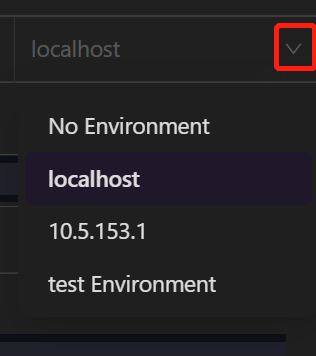

AREX 服务安装完成后，即可通过浏览器（推荐使用 Chrome 浏览器）访问 AREX 前端页面：

- 如果未修改端口配置，则直接访问 8088 端口 (Docker Compose 暴露端口 8088) [http://0.0.0.0:8088/](http://10.5.153.1:8088/)
- 如果独立部署前端，且未修改端口的 (缺省端口 8080) [http://0.0.0.0:8080/](http://10.5.153.1:8080/)
- 如果端口做了修改，则按照修改后的端口访问

## 首次登陆

首次登录需要输入你的个人邮箱，邮箱收到验证码后点击 Login 完成登录。

也可以直接点击下 **Guest** 链接进行登录，但登录后不具备邀请功能（即用例分享功能）。

## Chrome 插件安装

注意：在使用前需要根据浏览器提示安装 Chrome 插件，解除浏览器跨域限制。

如不能访问 Chrome 插件，可通过 [Release](https://github.com/arextest/arex-chrome-extension/releases) 下载到本地安装。

## 界面组成

AREX 前端页面主要包含页眉、菜单栏、工作台三大区域。

### 页眉（Header）

- Invite：邀请其他人参与某 Workspace 的协同工作。

-  设置：切换页面暗黑/明亮模式、中/英文模式。

- Sign out：你可退出当前登录账号。

### 菜单栏

- Workspace：点击下拉菜单切换 Workspace；点击右侧 **+** 新建一个工作区；点击图标设置当前工作区；点击图标向当前工作区导入本地文件作为集合。
- Collection：查看常规测试用例和比对测试用例。
- Replay：访问 AREX 录制回放用例。
- Environment：创建新环境并配置环境变量。
- Setting：设置录制应用。

### 工作台

工作台是进行接口测试、回放测试、比对测试等操作时的主要区域。标签栏可以快速管理各种请求、集合、回放，右上角可以快捷选择环境。

#### 标签栏

你可以通过点击标签栏上的 **+** 图标新建一个请求。

#### 切换环境

根据需要，可以在页面右上角，快速切换为你所需要的环境。选中相应的环境，即可访问该环境中的变量。

