## 新建集合

通过建立集合将各类请求进行分组管理，可以帮助你更好地管理请求。

点击左侧菜单栏 “Collection” 中 “New” 按钮，新建一个集合：

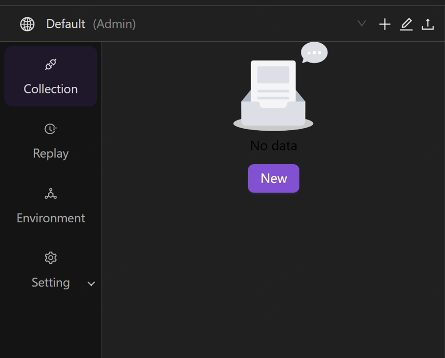

或点击 “Collection” 右侧的 **+** 新建一个集合：

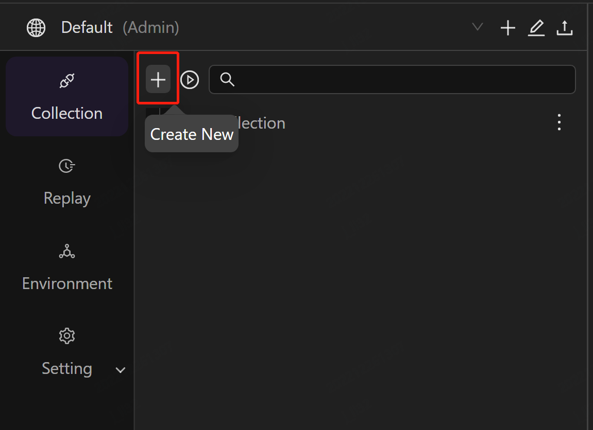

创建完成后，可以在左侧菜单栏管理集合。集合下还可以新增子集/文件夹。

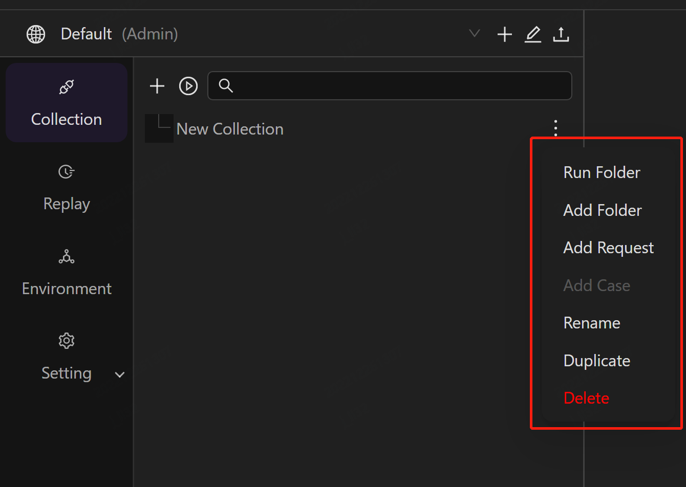

点击集合，可以对集合进行简单编辑。

**Authorization** 可以为集合设置授权类型。默认情况下，会对整个集合/文件夹下的请求生效。如需修改某一请求授权类型，可在该请求页面中单独进行修改。

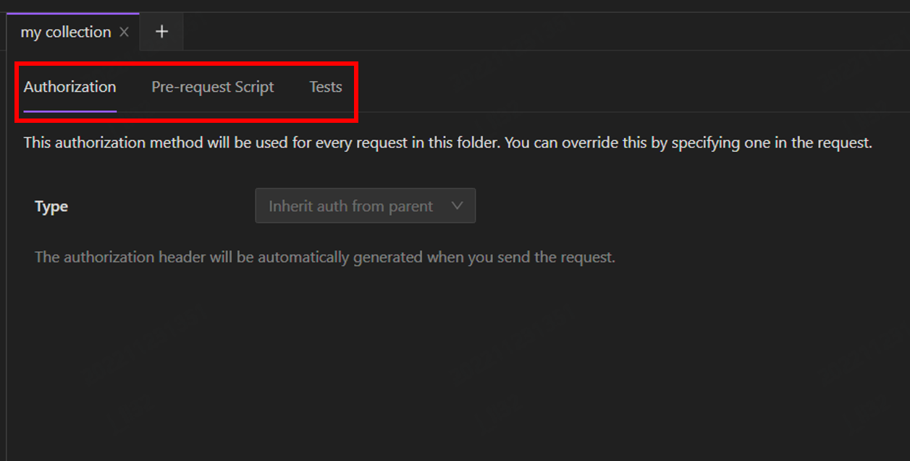

**Pre-request Script** 可以为集合编写前置脚本。脚本将在此集合中的每个请求之前执行。

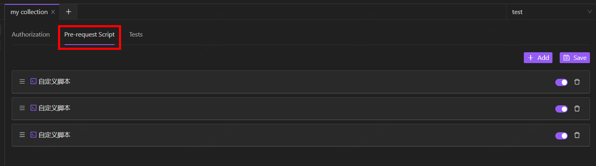

**Tests** 可以为集合添加测试脚本，该测试将在此集合中的每个请求之后执行。

## 新建工作区

首次登陆时将进入默认工作区。你可以创建不同的工作区供自己使用，也可以邀请你的团队在你的工作区中协作管理 Collection、共享 Environment 等。

1. 点击菜单栏右上方的 “**+**” 图标可以新建一个工作区。

    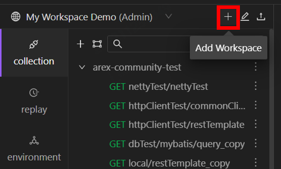

2. 在左侧输入框中为你的工作区命名并点击 “**√**” 图标完成创建。

    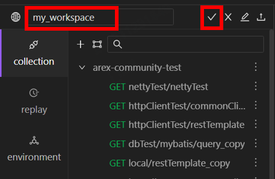

3. 创建完成后，可点击菜单栏右上角的图标对当前工作区进行设置，你可在这里修改工作区的名称、查看当前协作人员、并可以删除工作区。

    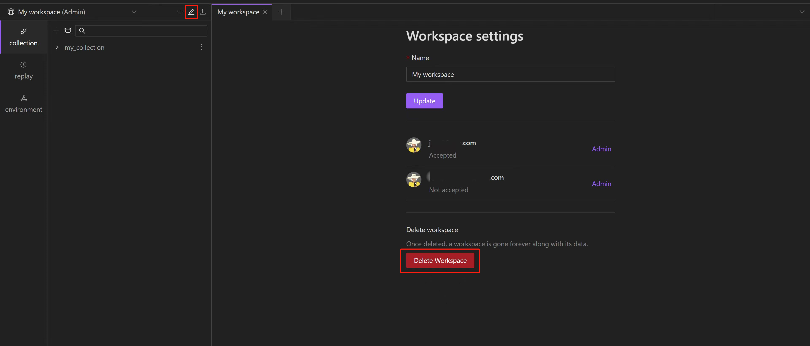

当然，你也可以点击页面右上角 **Invite** 通过邮箱来邀请你的团队成员加入工作区，可以赋予成员管理、编辑、浏览三种权限。

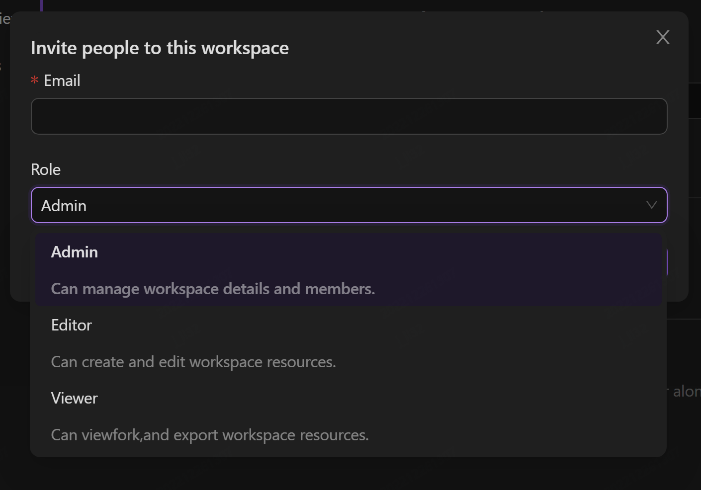

## 新建请求

你可通过 AREX 创建并发送接口请求，进行常规测试。

若要创建新请求，可以先创建新集合，点击集合右侧下拉菜单新建一个请求：

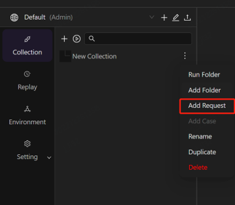

输入接口 URL 及参数，即可快速发送请求：

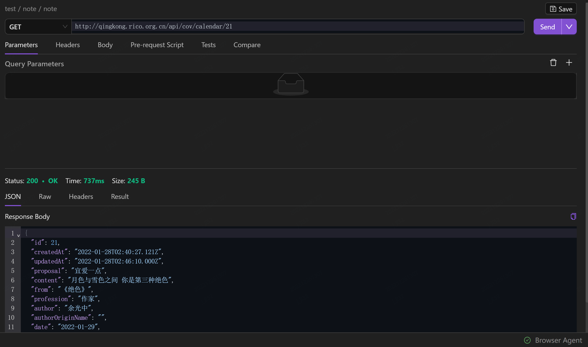
