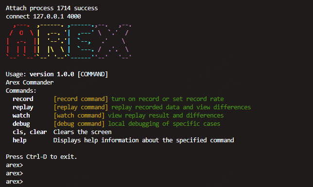

## AREX Agent deployment

***Configuration-javaagent enables the agent to be dynamically injected into the jvm to run AREX Agent***
  
AREX agent runs on AREX configuration service ([AREX config service](https://github.com/arextest/arex-config)) and AREX storage service ([AREX storage service](https://github.com/arextest/ arex-storage)).

### Configure java parameter running mode
Adjust and modify the host and port of the two dependent services, the template is as follows
* arex-agent-<version>.jar is the name of the jar package provided by AREX or compiled by itself, pay attention to modify the path
* your-service-name The name of the service being tested, different services must have different names
* your-application.jar JAR of your service under test
````other
java -javaagent:/path/to/arex-agent-<version>.jar
      -Darex.service.name=your-service-name
      -Darex.storage.service.host=[storage.service.host:port](storage.service.host:port)
      -Darex.config.service.host=[config.service.host:port](config.service.host:port)
      -jar your-application.jar
````

### Configuration file run mode
You can configure the `arex.agent.conf` configuration file (same content as above), such as

````other
arex.service.name=your-service-name
arex.storage.service.host=<storage.service.host:port>
arex.config.service.host=<config.service.host:port>
````

Then run the following command:

````other
java -javaagent:/path/to/arex-agent-<version>.jar
      -Darex.config.path=/path/to/arex.agent.conf
      -jar your-application.jar
````

### Modify JAVA_OPTS to run
For example, when running tomcat, you can directly modify catalina.sh, modify JAVA_OPTS to run, or configure it directly in environment variables
Take Linux as an example
export JAVA_OPTS=-Djavaagent:/path/to/arex-agent-<version>.jar -Darex.config.path=/path/to/arex.agent.conf

### Local mode running via ArexCli

````
git clone https://github.com/arextest/arex-agent-java.git
cd arex-agent-java
mvn clean install
````
run command line
````
chmod 550 bin/arex-cli.sh
cd ./bin/
./arex-cli
````

Or run the following command line
````other
git clone https://github.com/arextest/arex-agent-java.git
cd arex-agent-java
mvn clean install
java -cp "./arex-cli-parent/arex-cli/target/arex-cli.jar" io.arex.cli.ArexCli
````
#### The supported commands are as follows:
- **record**- record data or set record rate
    - `[option: -r/--rate]` set record rate, default value 1, record once every 60 seconds
    - `[option: -c/--close]` shut down record
- **replay**- replay recorded data and view differences
    - `[option: -n/--num]` replay numbers, default the latest 10
- **watch**- view replay result and differences
    - `[option: -r/--replayId]` replay id, multiple are separated by spaces
- **debug**- local debugging of specific cases
    - `[option: -r/--recordId]` record id, required Option


  
In local mode, AREX uses [H2](https://www.h2database.com) as local storage to save test data, no longer depends on configuration service and storage service, but you can't use AREX's front-end interface.


## Agent Setup (En)

***Enable the instrumentation agent by configuring a `javaagent` flag to the JVM to run arex:***

AREX agent works along with the [AREX config service](https://github.com/arextest/arex-config) and the [AREX storage service](https://github.com/arextest/arex-storage).

You could just configure the host and port of them respectively, like below

````other
java -javaagent:/path/to/arex-agent-<version>.jar
      -Darex.service.name=your-service-name
      -Darex.storage.service.host=[storage.service.host:port](storage.service.host:port)
      -Darex.config.service.host=[config.service.host:port](config.service.host:port)
      -jar your-application.jar
````


Alternatively, you can put those configuration items in `arex.agent.conf` file, like below

````other
arex.service.name=your-service-name
arex.storage.service.host=<storage.service.host:port>
arex.config.service.host=<config.service.host:port>
````


Then simply run:

````other
java -javaagent:/path/to/arex-agent-<version>.jar
      -Darex.config.path=/path/to/arex.agent.conf
      -jar your-application.jar
````


***Also, You can Run with CLI in local mode:***

Simply click the script in the `arex-agent-java/bin` directory to start the command line tool, or run it by following `java` command:

````other
java -cp "/path/to/arex-cli-parent/arex-cli/target/arex-cli.jar" io.arex.cli.ArexCli
````


The supported commands are as follows:


- **record**- record data or set record rate

`[option: -r/--rate]` set record rate, default value 1, record once every 60 seconds

`[option: -c/--close]` shut down record


- **replay**- replay recorded data and view differences

`[option: -n/--num]` replay numbers, default the latest 10


- **watch**- view replay result and differences

`[option: -r/--replayId]` replay id, multiple are separated by spaces


- **debug**- local debugging of specific cases

`[option: -r/--recordId]` record id, required Option

In local mode, AREX uses [H2](https://www.h2database.com) as a local storage to save the recorded data for testing purpose, Config Service and Storage Service are no longer required, But you can't use the AREX-UI in this mode either.