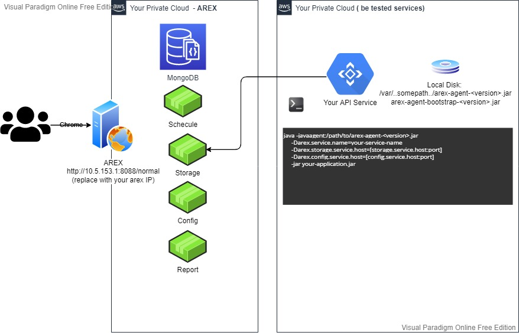

## AREX Arch

## Install AREX's Services
```
git clone https://github.com/arextest/deployments.git
cd deployments
docker-compose up -d
```

## Extension by yourself

  In the Java, we use [Service Provider Interface](https://docs.oracle.com/javase/tutorial/ext/basics/spi.html) mechanism to load services dynamically. 
  
  You can find service contracts in our components listed above.
  
## A live demo

There is a [live demo](https://github.com/arextest/arex) created from [Spring-Petclinic](https://github.com/spring-projects/spring-petclinic).
