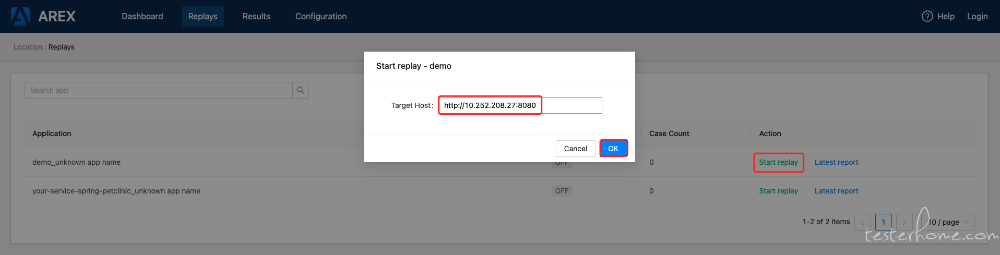
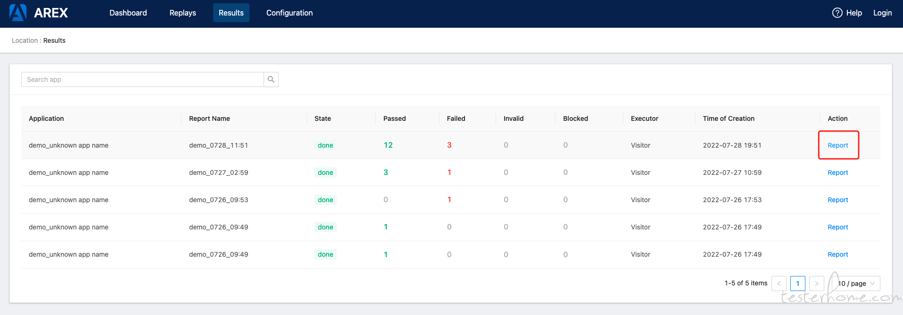
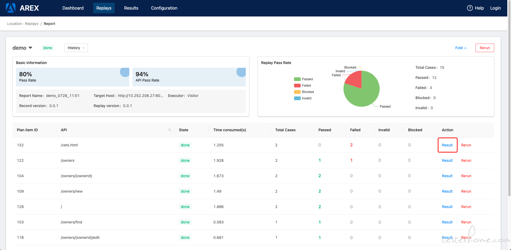

## 新手指南

[感谢TesterHome: imath60 编写的"AREX上手体验浅谈", 访问原文点我](https://testerhome.com/topics/33978)

### 背景介绍  
在业务的全生命周期内，在发布 PipeLine 上设置质量卡点，自动化回归测试【接口 + 链路】，保障接口与链路两个维度的质量，把控发布质量，守好上线前的最后一道防线。本文将介绍基于 AREX 的接口 RECORD、REPLAY & DIFF 能力。

### 新手指南
####  AREX 部署
```
git clone git@github.com:arextest/deployments.git
cd deployments
docker-compose up
```  
  
部署成功效果：  


#### 编译 AREX-AGENT  
```
git clone git@github.com:arextest/arex-agent-java.git
mvn clean install
```  

编译成功效果：  


#### 将 AREX-AGENT 注入被测服务，完成录制
```
java -javaagent:./arex-agent-0.0.1.jar 
     -Darex.config.path=./arex.agent.conf 
     -jar spring-petclinic-2.7.0-SNAPSHOT.jar
```

注入启动成功效果：  


### 使用 AREX-UI 完成回放与 DIFF

#### 启动回放


#### 回放执行


#### 回放结果


#### 回放报告


###  优化建议
1、 优先完善文档系统建设，包括但不限于部署文档、使用文档、开发文档等；
2、 deployments 及 集成 arex-agent 的 demo 项目持续完善 力争开箱即用 减少初期因文档不完善，上手问题阻塞影响；
3、 开始 arex-ui 的本地化工作，中文&英文同步更新。

### 未来展望
1、 基于 arex 的接口流量录制&回放能力，与人工编写接口接口测试脚本结合打造接口质量验证能力；  
2、 结合接口流量录制的 spanid，traceid 透传，完成链路维度的透传，与现有基于人工编写的场景用例结合，打造链路质量验证能力；  
3、 将上述能力与自动化测试任务集像关联，结合精准测试与代码染色构建的正反双向追溯系统，基于代码变更，给出变更范围与影响范围，推荐自动化测试用例集并执行，根据代码染色计算变更及影响覆盖率，结合发布流水线的质量卡点阈值，支撑发布决策。  

