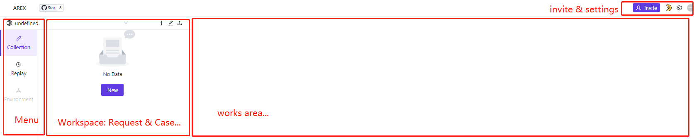
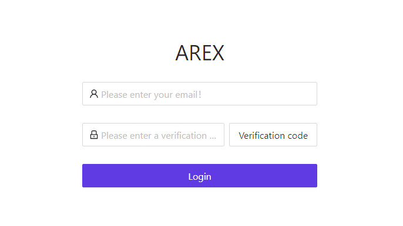
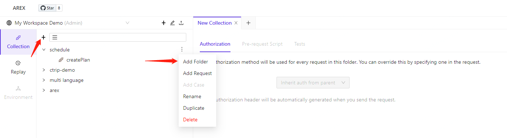

# 使用入门
AREX服务安装完成后,就可以通过浏览器访问AREX前端, 通过AREX前端执行用例配置执行,
录制回放记录和报告,管理用例和测试结果等.

## 界面简介
安装完成后,通过浏览器访问(假定服务器地址为10.5.153.1)
* 未修改端口配置,则直接访问8088端口(DockerCompose暴露端口8088) http://10.5.153.1:8088/
* 如果独立部署前端,且未修改端口的(缺省端口8080) http://10.5.153.1:8080/
* 如果端口做了修改,则按照修改后的端口访问

### 界面组成

包含如下几个区域
* 菜单区,Collection菜单(查看常规用例和比对测试用例),Replay菜单(访问AREX录制回放用例),Environment(环境配置)
* workspace区, 菜单区上方,显示和配置workspace的地方,workspace是用户用例集合存放的地方,每个用户可以配置/删除workspace,在workspace中增加/显示/配置/删除/执行测试用例
* 工作区, 主功能区域,显示和操作AREX操作功能的地方
* 右上方,邀请按钮(邀请其他人参与某Workspace,协同工作)及设置按钮(设置暗黑模式/明亮模式)

### Chrome插件
* 推荐浏览器Chrome访问
* 如果能访问Chrome插件,访问AREX界面时,按照浏览器提示安装插件即可
* 不能访问Chrome插件时,请下载到本地安装,[链接](https://github.com/zhangtao25/arex-chrome-extension/releases/download/1.0.1/dist.zip)

### 首次登陆

* 需要输入你个人邮箱,主要用来标识当前用户的唯一性  
* 也可以直接下面链接"guest"登录,但guest登录后不具备邀请功能(即用例分享功能)
* 邮箱收到验证码后,点击Login登录 

### 新建workspace

输入workspace名字,并确认

### 邀请其他人(TODO,此功能暂时不提供)

通过发送邮件来邀请其他人参与当前Workspace  
被邀请后用户刷新界面后,workspace会显示在用户的左上角workspace区域,用户可以选择这个WS,查看用例并操作等

## Workspaces

### 新建Collections

* 在根上增加collections
* 可以在Collections中再次增加Collection,包含关系根据用户需要来设置,不做限制
* 在Collection中增加Request(API接口的单位,某一个具体接口)
* 对Collection的管理操作,包括增加,配置,删除等  
操作界面示例  

