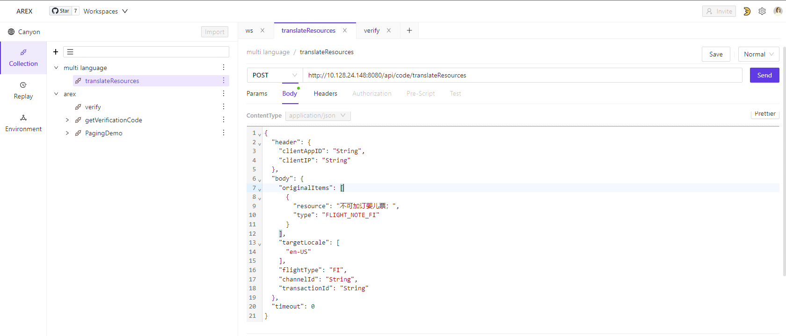
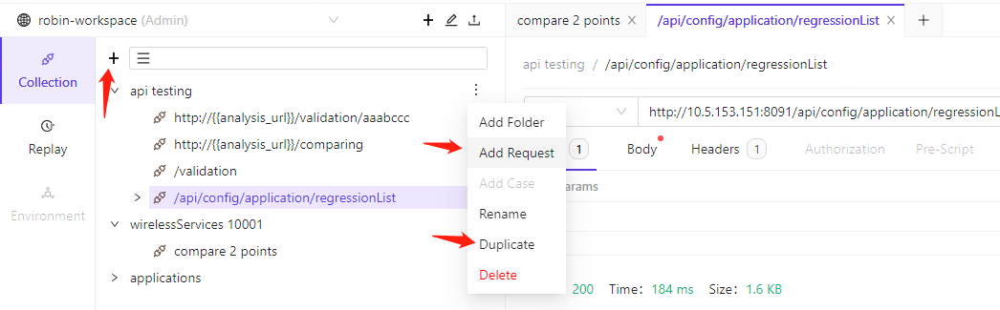
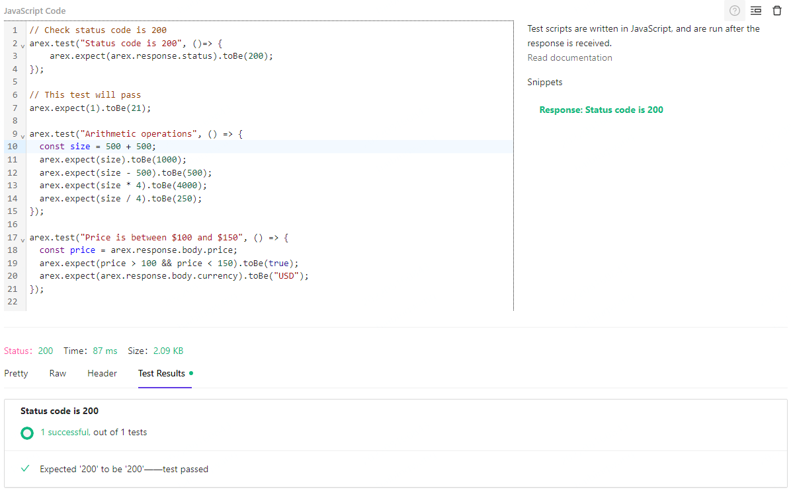

## Routine test

### Interface example

### Routine testing
The basic function of the interface test is to configure the interface address and its parameters. Refer to Postman for the interface.
* Configure HTTP request type, GET/POST/PUT/DELETE/PATCH
* configure params
* Configure Body
* Configure Header
* Configuration parameters

### Quick request

* Select Add Request on Collection to create a new quick request
* Duplicate fast request and its case (if any)

#### test case
The relationship between CASE and fast request (Request)
* CASE is similar to fast request, the configurable content is the same
* CASE is included in Request
* CASE is a configuration parameter that inherits Request. In order to facilitate users to test the same interface, only a small number of parameters are re-modified, which simplifies the use of users.

#### Configure Request

* CASE use case name can directly modify the current use case name
* SAVE button to save the current use case
* The result of the response message, Stauts, Time and Size, etc.
* Show: JSON messages and Pretty-optimized JSON

#### Configure ASSERT

* Configure ASSERT
* Display verification results in Test Resuts