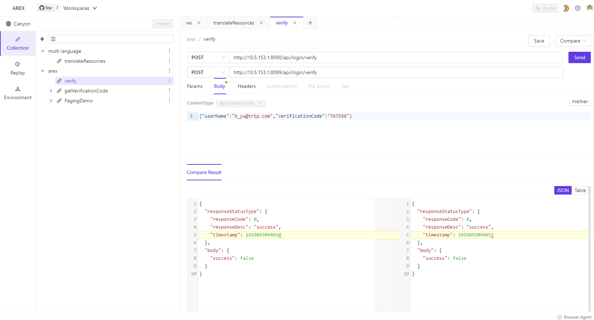

# Compare Testing  

## 比对测试
比对测试,就是将同一个报文往两个API地址发送请求,然后比对返回报文的差异  
使用的场景包括  
* 新老版本的接口比对,做验证验收测试
* 重构系统后的验证测试,重构后的新老系统返回结果理论上应该不变的
等 

* 比对测试结果,如有存在比对差异,则用有色背景来区别显示(如上图黄色背景)
* 注: 此界面在优化中,多差异点时界面显示不合理