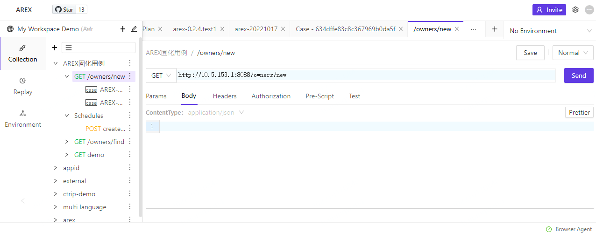
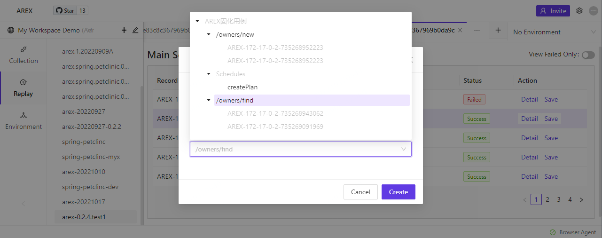

# 固化 AREX 录制回放的测试用例

### AREX 用例固化准备

#### Collection 中增加目录,存放计划固化的用例

- Collection 下面新建"Add Request"
- 填入 URL 等配置信息(0.2.5 版本计划缺省配置上,0.2.4 版本尚未提供缺省 URL,需要用户自行配置)

#### AREX 录制和回放

在应用录制和回放完成后,进入回放报告页面

点击 Case 进入如下 Case 页面

点击 Save 按钮,将此用例固化到 Collections 中

界面跟常规用例类似,多出的 MOCK 就是 AREX 录制并回放的数据(编辑功能开发中)

