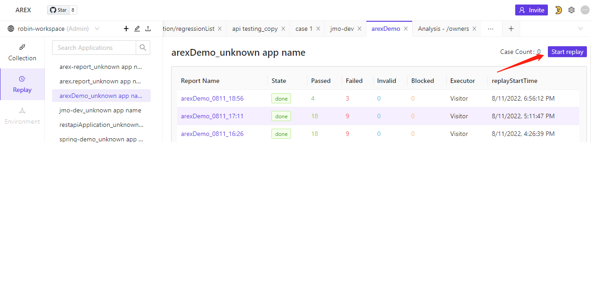
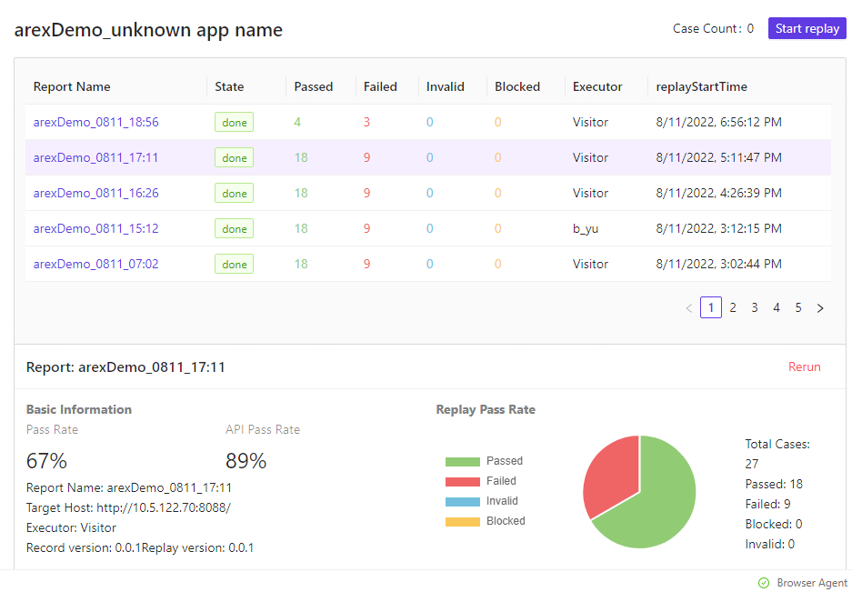
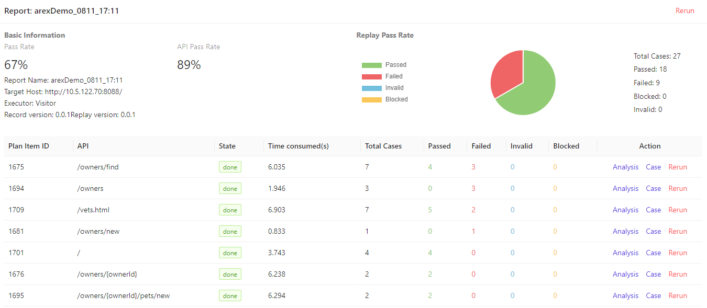
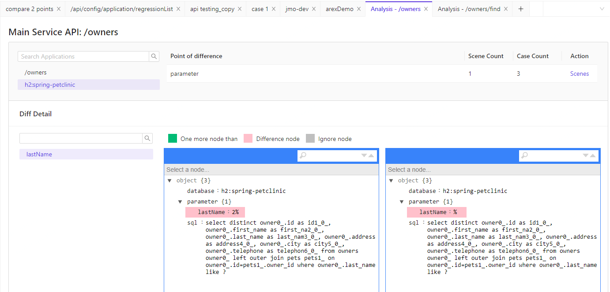
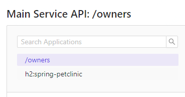

# AREX recording and playback test

## The first page of the recording and playback

* Select the Replay button in the menu area
* Select the AREX recording application in the Workspace area (after the application is configured with AREX Agent, it will be automatically displayed here)
* After selecting a specific application, the work area displays the report information of this application

### Perform recording playback
* Click "Start Replay" to perform playback

### Playback records and details

* Select the playback record in the list (ReportName contains the specific time of playback)
* The latest playback record is displayed at the front, you can view more history by turning the page
* After selecting the playback record, enter Report to see the specific playback results

### Playback report

* At the top of the report, "Rerun" can rerun the test here
* Display the test statistics of this execution
* Display each API test result, time, case and pass status of this execution
* When it is found that Failed is not 0 (differences are found by comparison), click Analysis to view the packet differences

### Packet difference

* The upper left area is the main interface and its external calls

* Tested API:/Owners, and third-party dependencies called internally by its interface, such as databases

* Display the number of scenes, the number of use cases, click "Scenes" on the right
* Diff Detail shows the difference node, the difference information is as follows
