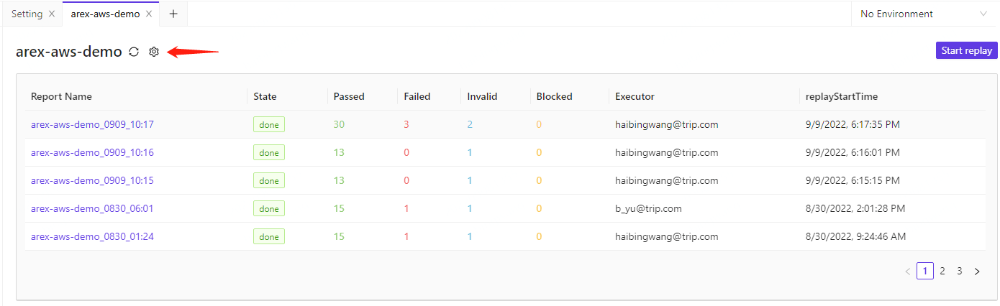

# 用例管理
* AREX现在实现的是API请求的增删改查,CASE的增删改查
* API请求的执行和应答解析
* Script的执行
* 开发中的功能: 用例批量执行,批量执行报告等

## 快速请求(Request)
* 设置请求类型GET等
* 设置请求Body
* 设置请求Headers
* 配置请求的Authorization
* 配置请求前的Pre-Script脚本
* 设计和设置ASSERT脚本

## 测试用例(CASE)
* CASE类型类似Request,但可以继承Request的配置,减少用例设计成本

  